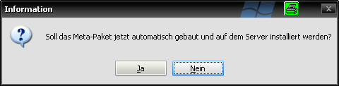

Paketbündel erzeugen
====================

|image48|

Mit der Funktion "Paketbündel erzeugen" können sog. Meta-Installationspakete erstellt werden. Diese Pakete beinhalten keinerlei Skriptfunktionalität, sondern bestehen nur aus Abhängigkeiten zu anderen Paketen.

Beispiel:

Auf allen Clients sollen immer wieder die gleichen 15 Softwarepakete installiert werden. Um nicht bei jedem Client 15 Pakete auf "setup" setzen zu müssen mit der Gefahr, einzelne Pakete oder Clients auszulassen, kann alternativ ein weiteres Paket erzeugt werden, das eine Abhängigkeit zu allen anderen 15 Paketen besitzt. Wird dieses Paket auf "setup" gesetzt, wird es gemäß seiner Abhängigkeiten erst dann installiert, wenn sämtliche anderen, abhängigen Pakete erfolgreich installiert worden sind.

Damit lassen sich sehr leicht gruppen- und zweckorientierte Anwendungspakete schnüren.

Vorgehensweise

Um mit Hilfe von opsi Package Builder solche Bündel zu erzeugen, einfach wie folgt vorgehen:

   #. Über den Startdialog oder das Anwendungsmenü die Funktion "Paketbündel erzeugen" auswählen Daraufhin werden sämtliche aktiven Localboot Pakete des verbundenen opsi Servers ermittelt (sofern noch nicht geschehen, bspw. durch Öffnen des Zeitplaners) und in einer Tabelle dargestellt.
   #. Die zu bündelnden Produkte mit einem Haken vor der Produkt ID versehen.
   #. Den Dialog mit der Schaltfläche "OK" bestätigen.
   #. In der nachfolgenden Abfrage eine neue Produkt ID für das Meta-Paket erfassen und den Dialog mit "Ok" bestätigen. Es wird geprüft, ob ein Paket gleichen Namens existiert.

Damit ist generell ein neues Paket mit den entsprechenden Gegebenheiten angelegt. Soll das Paket jetzt noch zusätzlich direkt auf dem Server gebaut und installiert werden, so auch den nachfolgenden Dialog mit "Ja" bestätigen.

|image49|

.. |image48| image:: ../img/Paketbndel.png
