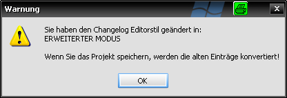
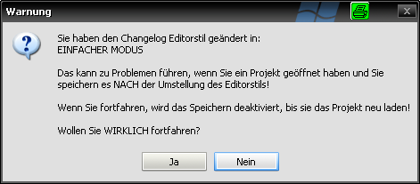

.. _conversionhints:

Konvertierungshinweise
======================

Konvertierung von einfacher in erweiterte Darstellung und Funktionalität

Alte Changelog Einträge, die nicht einer festen strukturierten Form entsprechen, können in die strukturierte Form überführt werden, ohne dass die Inhalte verloren gehen.

Dazu ist folgende Reihenfolge in der Vorgehensweise einzuhalten:

#. opsi Package Builder starten
#. unter "Einstellungen" - "Programmeinstellungen" den Haken bei "Erweiterten Changelog Editor verwenden" entfernen (die auftretende Meldung kann ignoriert werden, solange kein Paket geladen ist)
#. das Paket mit den zu konvertierenden Changelog Einträgen öffnen
#. unter "Einstellungen" - "Programmeinstellungen" den Haken bei "Erweiterten Changelog Editor verwenden" setzen es erfolgt folgende Meldung:

|image36|

#. das Paket speichern

Jetzt liegt das Changelog inkl. der alten Einträge im neuen Format vor und kann mit dem erweiterten Editor bearbeitet werden.

Beispiel für umgestellte Einträge

Einträge vor der Konvertierung::

    [Changelog]

    Das hier ist nur allgemeines Changelog blabla ohne Struktur

    damit läßt sich nicht viel anfangen

    aber gehen tuts auch

    brabrabra

    tätäta

Einträge nach der Konvertierung::

    [Changelog]

    acroread (11.0.01-2) testing; urgency=low

      \* ChangeLog converted via opsi PackageBuilder editor

                    ----------- ALTES CHANGELOG FORMAT -----------

                    Das hier ist nur allgemeines Changelog blabla ohne Struktur

                    damit läßt sich nicht viel anfangen

                    aber gehen tuts auch

                    brabrabra

                    tätäta

                    ----------- ALTES CHANGELOG FORMAT -----------

     -- Holger Pandel <holger.pandel@....de> Tue, 02 Apr 2013 18:03:37 +0100

Konvertierung von erweiterter in einfache Darstellung und Funktionalität

In diese Richtung findet keine Konvertierung statt. Es reicht, unter "Einstellungen" - "Programmeinstellungen" den Haken bei "Erweiterten Changelog Editor verwenden" zu entfernen.

Sollte zu diesem Zeitpunkt bereits ein Paket geladen sein, erfolgt nachstehender Hinweis:

|image37|

Dies erfolgt aus Sicherheitsgründen, um keinen der bestehenden Einträge zu verlieren.

