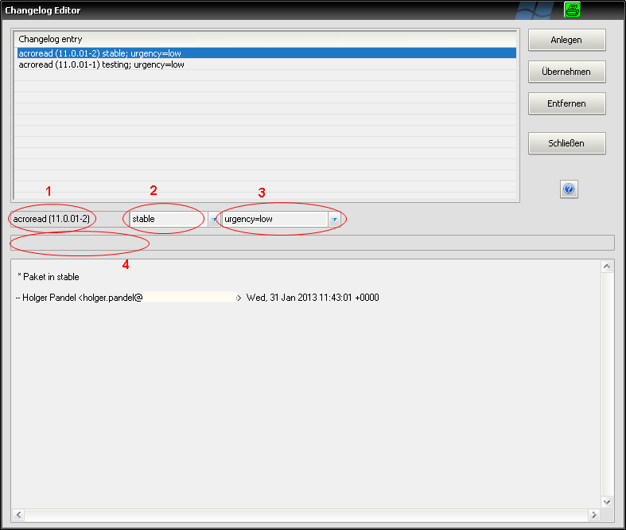
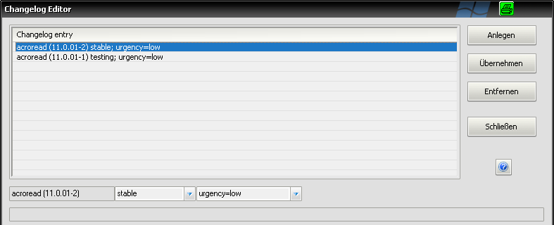
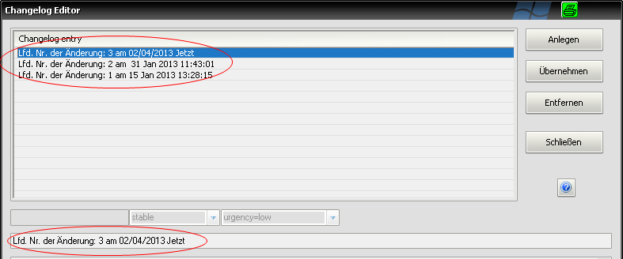

.. index:: ! Changelog Editor; Erweiterter Editor

.. _changelogeditor_extended:

Erweitert
=========

|image29|

Ist in den `Einstellungen <#Settings>`__ die Nutzung des erweiterten Changelog Editors aktiviert, erscheint beim Klick auf die Schaltfläche "Changelog" im `Reiter "Paket" <#ReiterPaket>`__ das erweiterte Editorfenster. Damit können die einzelnen Changelog Einträge komfortabel verwaltet werden.

*Hinweis:*
*Ist der erweiterte Editor ausgewählt und es tritt beim Einlesen eines Pakets ein Fehler bei der Changelog Blockerkennung auf, so wird der einfache Editor geöffnet. Der Benutzer erhält einen entsprechenden Warnhinweis.*

+-------------------------+-------------------------+-------------------------+
| Feld / Funktion         | Beschreibung            | Hinweise                |
+-------------------------+-------------------------+-------------------------+
| Tabelle "Changelog      | Alle vorhandenen        | absteigend sortiert     |
| Entry"                  | Changelog Einträge in   |                         |
|                         | der Reihenfolge der     |                         |
|                         | Anlage                  |                         |
+-------------------------+-------------------------+-------------------------+
| Feld 1                  | Paketversion des        | nur Anzeige             |
|                         | Changelog Eintrags      |                         |
|                         |                         | nur aktiv bei           |
|                         |                         | Standardblockerkennung  |
+-------------------------+-------------------------+-------------------------+
| Feld 2                  | Paketstatus Markierung  | Mögliche Werte: testing |
|                         |                         | / stable                |
|                         |                         |                         |
|                         |                         | nur aktiv bei           |
|                         |                         | Standardblockerkennung  |
+-------------------------+-------------------------+-------------------------+
| Feld 3                  | Dringlichkeitsmarkierun | Mögliche Werte:         |
|                         | g                       | urgency=low /           |
|                         | der Änderung            | urgency=middle /        |
|                         |                         | urgency=high            |
|                         |                         |                         |
|                         |                         | nur aktiv bei           |
|                         |                         | Standardblockerkennung  |
+-------------------------+-------------------------+-------------------------+
| Feld 4                  | Individuelles Header    | nur aktiv bei           |
|                         | Feld                    | individueller           |
|                         |                         | Blockerkennung          |
+-------------------------+-------------------------+-------------------------+
| unteres Editorfeld      | Langtext des Changelog  |                         |
|                         | Eintrags                |                         |
+-------------------------+-------------------------+-------------------------+
| |image30|               | Erzeugen eines neuen    | Der Eintrag bekommt     |
|                         | Eintrags                | einen initialen Text    |
|                         |                         | und eine letzte Zeile   |
|                         |                         | nach dem Schema         |
|                         |                         |                         |
|                         |                         | Maintainer/Mail/Datum/U |
|                         |                         | hrzeit/UTC              |
+-------------------------+-------------------------+-------------------------+
| |image31|               | Änderungen übernehmen   | Sämtliche Änderungen    |
|                         |                         | großen Textfeld, die    |
|                         |                         | nicht übernommen        |
|                         |                         | wurden, gehen beim      |
|                         |                         | Schließen des Dialogs   |
|                         |                         | verloren.               |
+-------------------------+-------------------------+-------------------------+
| |image32|               | Entfernen eines         | Es kann immer nur ein   |
|                         | Changelog Eintrags      | Eintrag auf einmal      |
|                         |                         | entfernt werden.        |
+-------------------------+-------------------------+-------------------------+
| |image33|               | Beenden des Dialogs     | Alle nicht übernommenen |
|                         |                         | Änderungen im Textfeld  |
|                         |                         | gehen verloren.         |
+-------------------------+-------------------------+-------------------------+

.. raw:: html

   

**Unterschiede in der Darstellung zwischen Standardblockerkennung und individueller Blockerkennung**

*Standardblockerkennung*

Bei der Standardblockerkennung sind die erweiterten Auswahl- und Eingabefelder aktiv.

|image34|

*Individuelle Blockerkennung*

Bei der individuellen Blockerkennung ist nur das freie Eingabefeld verfügbar.

|image35|

.. |image33| image:: ../img/btnSchliessen.png

