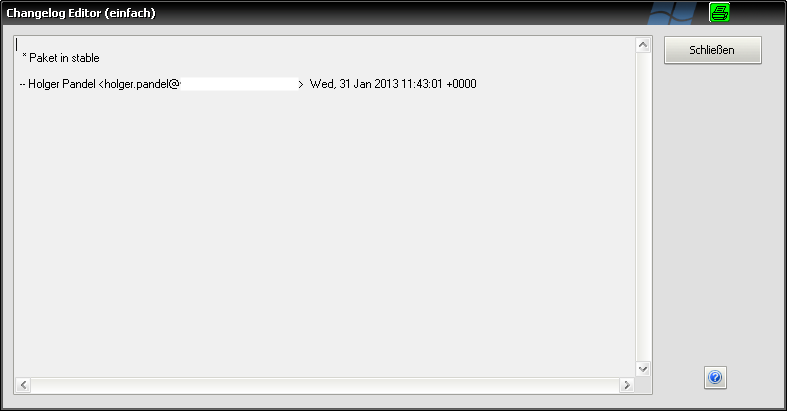

.. _changelogeditor_simple:

Einfach
=======

|image27|

Ist in den \ `Einstellungen <#Programmeinstellungen>`__\  die Nutzung des erweiterten Changelog Editors deaktiviert, erscheint beim Klick auf die Schaltfläche "Changelog" im \ `Reiter "Paket" <#ReiterPaket>`__\ das einfache Editorfenster. Hier kann reiner Fließtext in beliebiger Form als Hinterlegt werden.

Wird der Editor über die Schaltfläche \ |image28|\  geschlossen, werden autom. sämtliche Änderungen übernommen.

*Hinweis:*
*Ist der erweiterte Editor ausgewählt und es tritt beim Einlesen eines Pakets ein Fehler bei der Changelog Blockerkennung auf, so wird ebenfalls der einfache Editor geöffnet. Der Benutzer erhält einen entsprechenden Warnhinweis.*

