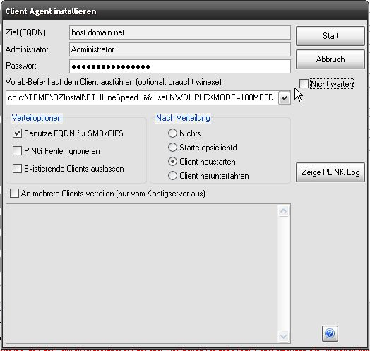

.. index:: ! Client Agent verteilen

Client Agent verteilen
======================

|image73|

Mit dieser Funktion kann der opsi-client-agent komfortabel per remote auf Clientrechner verteilt werden.

**Erläuterung zur Option "Nicht warten":**

Wird diese Option angewählt, so wird der Deploy Befehl auf dem Server abgesetzt und nicht auf die Beendigung der Ausführung gewartet, d. h. es gibt keine Rückmeldung über das Log. Bei größeren Deploys führt das dazu, dass der opsi PackageBuilder nicht "ewig" zu hängen scheint, sondern direkt wieder bedienbar wird.

Hinweise zum Feld "Vorab-Befehl":

Steht in diesem Feld eine Anweisung, so wird sie vor dem Deploy via winexe (entspricht weitestgehend psexec für Linux) direkt auf dem Client ausgeführt.

Daran sind allerdings einige Bedingungen geknüpft:

    - Auf dem Server muss das Programm ``winexe`` über die Pfadvariable erreichbar sein vorhanden sein (mit whereis prüfen) / hierbei wird nicht auf die im opsi-client-agent mitgelieferte Version zurückgegriffen.
    - Befehlsverkettung funktioniert begrenzt, da hilft im Einzelfall nur ausprobieren
    - Piping und Ausgabeumlenkung sind sehr fallabhängig. Da hilft es ebenfalls am ehesten, Logging einzuschalten und auszuprobieren.

**Achtung**::

    - Wird an einen einzelnen Client verteilt, so kann im Multi-Depot Betrieb der Quelldepotserver ausgewählt werden, um Leitungskapazitäten zu schonen.
    - Wenn an mehrere Clients verteilt wird, dann kann im Multi-Depot Betrieb KEIN Depotserver ausgewählt werden, da für den Deploybefehl eine Liste in Dateiform erstellt werden muss. Dies ist momentan nur auf dem Workbench Share des zugeordneten Konfigservers zulässig. Ebenfalls führt es zu Fehlern, wenn der Entwicklungsordner nicht auf dem Workbench Share des Konfigservers liegt. Dann kann der Deploybefehl ebenfalls nicht ordnungsgemäß abgesetzt werden.
    - In Einzelfällen kann es vorkommen, dass

**Fehlerbereinigung**::

    [2015-06-16 05:24:43 PM] - oPB.core.tools.OpsiProcessing       -  SSHINFO - Trying to execute command: sh -c /tmp/deploy.sh
    [2015-06-16 05:24:43 PM] - oPB.core.tools.OpsiProcessing       -  SSHINFO - sh: 1: /tmp/deploy.sh: Permission denied

Sollte im Log eine Meldung wie die beispielhaft aufgelistete erscheinen, so kann es daran liegen, dass die Rechte auf dem Verzeichnis ``/var/lib/opsi/depot/opsi-client-agent`` nicht korrekt gesetzt sind. Somit ist der opsi Benutzer nicht in der Lage, das Deployment Tool auszuführen. Um das zu beheben reicht es, sich

    - auf dem opsi Server via SSH einzuloggen und
    - einmalig ``opsi-setup --set-rights /var/lib/opsi/depot/opsi-client-agent``

auszuführen. Ggf. ist es vielleicht auch sinnvoll, einmalig den Befehl über den gesamten Ordner ``/var/lib/opsi/depot`` laufen zu lassen, wenn auch nicht nötig

