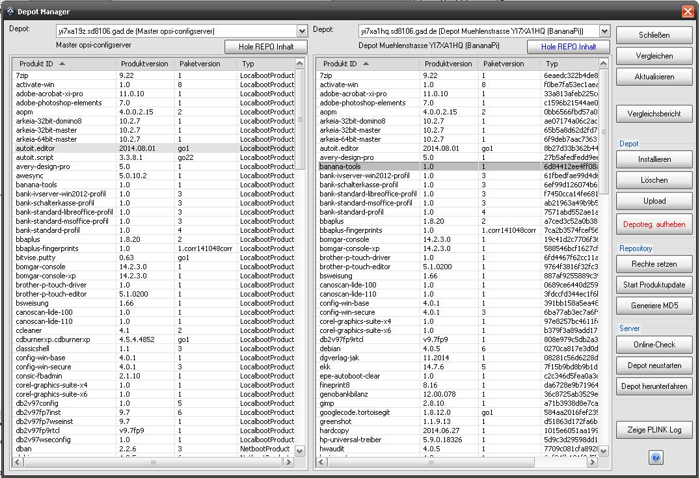
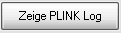
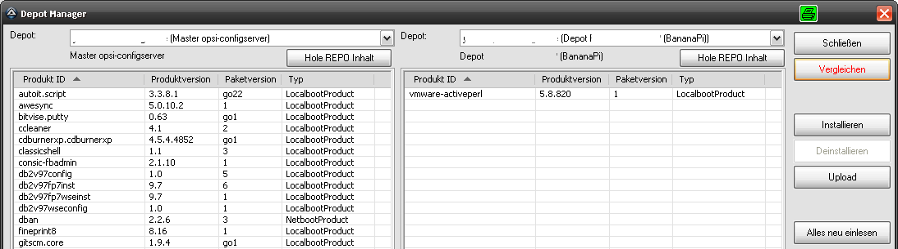
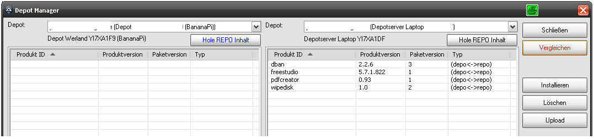
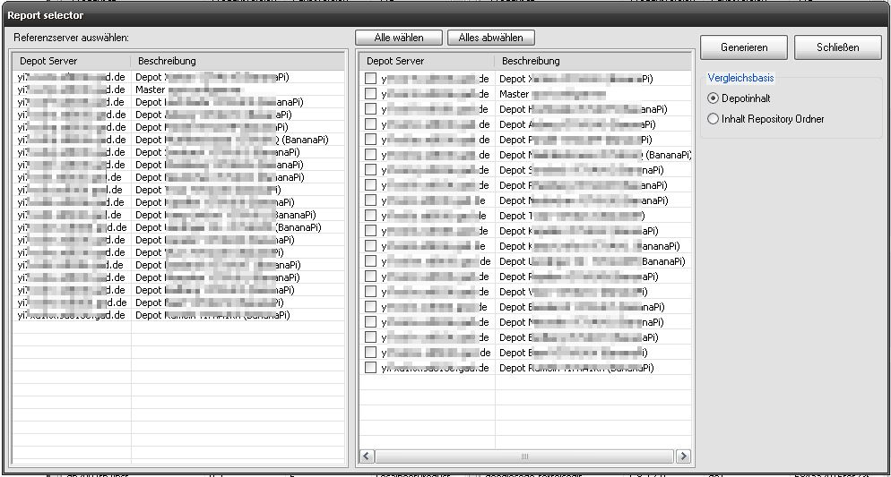

.. index:: ! Depot Manager

Depot Manager
=============

|image50|

Mit dem Depot Manager können Verwaltungsaufgaben im Bereich der Softwaredepots vorgenommen.

Hierzu gehören:

    - Einlesen der einzelnen Depotstände
    - Einlesen der jeweiligen Repository Ordner (/var/lib/opsi/repository)
    - Vergleichen verschiedener Depots untereinander, hierbei sind alle Kombination möglich: Depot<->Depot, Repo<->Repo und Depot<->Repo
    - Generieren von Berichten
    - Installieren / Deinstallieren / Hochladen von Paketen in einzelne Depots
    - Löschen von Paketen aus dem Repository Verzeichnis
    - Neuberechnen der MD5 Dateien
    - Reboot / Poweroff / Online-Check

*Hinweis:*
Die Depotfunktionen sind bei der ersten Inbetriebnahme deaktiviert und können in den Einstellungen, :ref:`settings_opsi` aktiviert werden. Die Depotserver werden automatisch ermittelt und in einem internen Cache zwischengespeichert. Sollte nicht alle Depots angezeigt werden, reicht es in der Regel, über |image56| eine Aktualisierung durchzuführen.

+-------------------------+-------------------------+---------------------------------+
| Feld / Funktion         | Beschreibung            | Hinweise                        |
+=========================+=========================+=================================+
| |image51|               | Die Tabellenanzeige     | Der Schalter arbeitet           |
|                         | schaltet zwischen       | wie ein Umschalter, d.          |
| |image52|               | Depotansicht und        | h. so lange er farbig           |
|                         | Repository              | markiert ist, wird der          |
|                         | Ordneransicht um.       | Inhalt des Repository           |
|                         |                         | Ordners angezeigt.              |
|                         |                         |                                 |
|                         |                         | Ist diese Funktion              |
|                         |                         | gewählt, zeigt die              |
|                         |                         | Spalte "Typ" der                |
|                         |                         | Tabelle die MD5 Summe           |
|                         |                         | des Pakets an.                  |
+-------------------------+-------------------------+---------------------------------+
| |image53|               | Beendet den Dialog      |                                 |
+-------------------------+-------------------------+---------------------------------+
| |image54|               | Vergleich der beiden    | Der Schalter arbeitet           |
|                         | Tabelleninhalte         | wie ein Umschalter, d.          |
| |image55|               | durchführen.            | h. so lange er farbig           |
|                         |                         | markiert ist, werden in         |
|                         | WICHTIG: Werden REPO    | den beiden Tabellen nur         |
|                         | Stände miteinander      | die Unterschiede                |
|                         | verglichen, so          | angezeigt.                      |
|                         | erfolgt der Vergleich   |                                 |
|                         | inklusive MD5 der       | Während der Vergleich           |
|                         | Datei.                  | durchgeführt wird, ist          |
|                         |                         | die Schrift rot, nach           |
|                         |                         | Abschluss des                   |
|                         |                         | Vergleichs grün.                |
+-------------------------+-------------------------+---------------------------------+
| |image56|               | Depots und Depotstände  | Achtung: Die                    |
|                         | neu einlesen            | vorhandenen Depotserver         |
|                         |                         | werden über einen               |
|                         |                         | Programmneustart hinaus         |
|                         |                         | zwischengespeichert!            |
|                         |                         | Falls Server in der             |
|                         |                         | Auflistung fehlen, kann         |
|                         |                         | einmaliges Neueinlesen          |
|                         |                         | helfen.                         |
+-------------------------+-------------------------+---------------------------------+
| |image57|               | Vergleichsreporte       |                                 |
|                         | generieren              |                                 |
+-------------------------+-------------------------+---------------------------------+
| |image58|               | Paket in ein Depot      | Es wird nach dem                |
|                         | installieren            | Zieldepot gefragt.              |
+-------------------------+-------------------------+---------------------------------+
| |image59|               | Diese Schaltfläche      | Die Schaltfläche ändert         |
|                         | erfüllt eine            | ihre Funktionsweise je          |
| |image60|               | Doppelfunktion:         | nachdem, was in der             |
|                         |                         | zuletzt angeklickten            |
|                         | Deinstallieren: das     | Tabelle gerade                  |
|                         | zuletzt angeklickte     | angezeigt wird.                 |
|                         | Paket in einer der      |                                 |
|                         | beiden Tabellen wird    |                                 |
|                         | auf dem zugehörigen     |                                 |
|                         | Depot deinstalliert     |                                 |
|                         |                         |                                 |
|                         | Löschen: das zuletzt    |                                 |
|                         | angeklickte Paket wird  |                                 |
|                         | aus dem Repository      |                                 |
|                         | Ordner (auf             |                                 |
|                         | Dateisystemebene)       |                                 |
|                         | gelöscht                |                                 |
|                         |                         |                                 |
|                         | (Mehrfachauswahl        |                                 |
|                         | möglich)                |                                 |
+-------------------------+-------------------------+---------------------------------+
| |image61|               | Paket in ein Repository | Die temporär auf den            |
|                         | hochladen. Dabei wird   | Configserver                    |
|                         | das Paket erst auf den  | übertragene Datei wird          |
|                         | Configserver in ein     | sicherheitshalber nicht         |
|                         | temporäres Verzeichnis  | autom. gelöscht.                |
|                         | geschrieben und         |                                 |
|                         | danach per              |                                 |
|                         | "opsi-package-manager   |                                 |
|                         | -u -d" verarbeitet.     |                                 |
+-------------------------+-------------------------+---------------------------------+
| |image62|               | Hebt die Registrierung  |                                 |
|                         | des Depotservers am     |                                 |
|                         | Konfigserver auf. Damit |                                 |
|                         | wird der Depotserver    |                                 |
|                         | ABER NICHT gelöscht,    |                                 |
|                         | sondern nur aus der     |                                 |
|                         | internen Hosttabelle    |                                 |
|                         | entfernt!               |                                 |
+-------------------------+-------------------------+---------------------------------+
| |image63|               | Führt den Befehl        | Kann nur dann verwendet         |
|                         | "opsi-setup             | werden, wenn "Hole REPO         |
|                         | --set-rights            | Inhalt" aktiv ist.              |
|                         | /var/lib/opsi/repositor |                                 |
|                         | y"                      | Ist bspw. dann                  |
|                         | auf dem ausgewählten    | erforderlich, wenn auf          |
|                         | Depot aus.              | den Inhalt einer                |
|                         |                         | MD5-Datei eines Pakets          |
|                         |                         | nicht zugegriffen               |
|                         |                         | werden kann.                    |
+-------------------------+-------------------------+---------------------------------+
| |image64|               | Führt den Befehl        | Kann nur dann verwendet         |
|                         | "opsi-package-updater   | werden, wenn "Hole REPO         |
|                         | -vv" auf dem gewählten  | Inhalt" aktiv ist.              |
|                         | Depot aus.              |                                 |
+-------------------------+-------------------------+---------------------------------+
| |image65|               | Generiert für die       |                                 |
|                         | ausgewählten Produkte   |                                 |
|                         | auf dem betreffenden    |                                 |
|                         | Repository die MD5      |                                 |
|                         | Dateien.                |                                 |
+-------------------------+-------------------------+---------------------------------+
| |image66|               | Ping-Check auf das      |                                 |
|                         | gewählte Depot          |                                 |
+-------------------------+-------------------------+---------------------------------+
| |image67|               | Reboot eines Depots     |                                 |
+-------------------------+-------------------------+---------------------------------+
| |image68|               | Shutdown eines Depots   |                                 |
+-------------------------+-------------------------+---------------------------------+
| |image69|               | Anzeige des Logbuchs    |                                 |
+-------------------------+-------------------------+---------------------------------+

**Beispiel I für eine Vergleichssituation zwischen zwei Depots:**

|image70|

Im linken Depot befinden sich jede Menge Produkte, die das rechte Depot
nicht kennt. Umgekehrt hat das rechte ein zusätzlich Produkt.

**Beispiel II für eine Vergleichssituation zwischen Depot und Repository Ordner:**

|image71|

Wie man erkennen kann, sind folgende Funktionen aktiv:

    - linke Tabelle: Ansicht Repository Ordner
    - rechte Tabelle: Depot
    - Vergleichsmodus ist eingeschaltet

-> Im rechten Repo sind 4 Pakete vorhanden, die sich im linken Depot nicht befinden.

*Hinweis:*
*Das in der Spalte "Typ" nur "(depo<->repo)" angezeigt wird, liegt daran, dass im Repository Ordner die Produkttypen "NetbootProduct" bzw. "LocalbootProduct" nicht einfach ermittelbar sind.*

.. index:: ! Depot Manager; Reporte generieren

Report generieren
-----------------

|image72|

Mit Hilfe des Reportauswahl-Dialogs können gezielt Depotvergleiche durchgeführt und als druckbare HTML Reporte ausgegeben werden.

**HINWEIS:**
**Wird als Vergleichsbasis "Inhalt Repository Ordner" gewählt, kann die Berichtsgenerierung bei einer großen Serveranzahl recht lange dauern.**

.. |image53| image:: ../img/btnSchließen.png

.. |image57| image:: ../img/btnVergleichsbericht.png

.. |image62| image:: ../img/btnDepotRegAufheben.png

