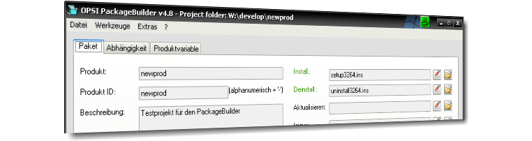

Programmoberfläche
==================

|image1|

Nachfolgend werden die einzelnen Oberflächenbestandteile der Anwendung
beschrieben und, wenn vorhanden, auf Besonderheiten im Umgang damit
eingegangen.

.. toctree::
   :maxdepth: 2

   start
   tabpacket
   tabdepend
   tabprop
   packetfunctions
   changelogeditor
   scripttree
   scheduler
   bundle
   depotmanager
   deployclientagent
   menu

