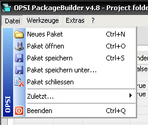
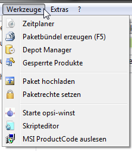
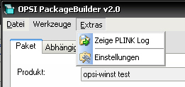
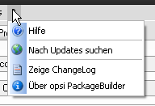

.. index:: ! Menü

Menü
====

Erläuterungen zum Menü erfolgen in den einzelnen Kapiteln, falls notwendig.

.. index:: ! Menü; Datei

Datei
-----

|image74|

.. index:: ! Menü; Werkzeuge

Werkzeuge
---------

|image75|

   -  Skripte neu scannen
      Wenn Änderungen an den Installationsskripten durchgeführt und insbesondere weitere Include- oder Sub-Anweisungen eingebaut wurden, so kann die Paketstruktur hiermit für eine korrekte Darstellung im Skriptbaum neu eingelesen werden.
   -  Paketrechte setzen
      Die Linux-seitig bestehenden Verzeichnisrechte auf den opsi Standard korrigieren. Dazu ist allerdings in den \ `Einstellungen <#Allgemein>`__\  die Hinterlegung des root Kennworts des opsi Servers notwendig.
   -  Start opsi-winst
      Starten der opsi-winst Entwicklungsoberfläche zum Starten/ Überwachen und Debuggen von opsi-winst Skripten. Der Menüpunkt setzte eine bestehende opsi-winst-client Installation voraus, bzw sucht die winst32.exe in folgendem Pfad:
      %ProgramFiles%\\opsi.org\\opsi-client-agent\\opsi-winst\\winst32.exe
   -  Skripteditor
      Startet den in den Einstellungen hinterlegten Editor.

.. index:: ! Menü; Extras

Extras
------

|image76|

   -  Zeige PLINK Log
      Für den Fall, die Anzeige des PLINK Logs nach erfolgter Onlinefunktion wurde in den Einstellungen abgeschaltet, kann die Anzeige hier manuell aufgerufen werden.

|image77|

   -  Nach Updates suchen
      Manuellen Aktualisierung der installierten Version von opsi Package Builder durchführen, falls eine neuere Version verfügbar ist.
   -  Zeige Changelog
      Das opsi Package Builder Versions-Changelog anzeigen (im Gegensatz zum Paket-Changelog!)

