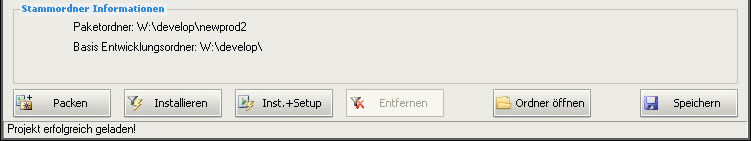

.. index:: ! Paketfunktionen

Paketfunktionen
===============

|image17|

Im unteren Teil des Anwendungsfensters bleiben die Onlinefunktionen, die zur Verfügung, stehen jederzeit sichtbar.

**Funktionsbeschreibung**

*Hinweis zur nachfolgenden Aufstellung:*
Sind die erweiterten Depotfunktionen aktiv, sind alle manuell hinterlegten Befehle außer Kraft, sondern werden ja nach verwendetem Depot intern autom. erzeugt.

+-------------------------+----------------------------------+-------------------------+
| Funktion                | Beschreibung                     | Besonderheiten bei      |
|                         |                                  | Offline Nutzung         |
+=========================+==================================+=========================+
| Paketordner             | Der Ordnername des               |                         |
|                         | aktuell geöffneten               |                         |
|                         | Pakets.                          |                         |
+-------------------------+----------------------------------+-------------------------+
| Basis                   | Der in den                       |                         |
| Entwicklungsordner      | :ref:`allgemeinen Einstellungen  |                         |
|                         | <settings_general>`              |                         |
|                         | hinterlegte Stammordner          |                         |
|                         | für Paketentwicklung.            |                         |
+-------------------------+----------------------------------+-------------------------+
| |image18|               | Onlinefunktion:                  | Die Funktion steht      |
|                         |                                  | nicht zur Verfügung.    |
|                         | Löst per SSH Verbindung          |                         |
|                         | zum opsi Server die              |                         |
|                         | Paketerzeugung aus.              |                         |
|                         |                                  |                         |
|                         | :ref:`Standardeinstellung        |                         |
|                         | <settings_opsi>`                 |                         |
|                         |                                  |                         |
|                         | des verwendeten                  |                         |
|                         | Befehls:                         |                         |
|                         |                                  |                         |
|                         | opsi-makeproductfile             |                         |
|                         | -vv                              |                         |
|                         |                                  |                         |
|                         | Weitere Informationen            |                         |
|                         | dazu im opsi Handbuch.           |                         |
+-------------------------+----------------------------------+-------------------------+
| |image19|               | Onlinefunktion:                  | Die Funktion steht      |
|                         |                                  | nicht zur Verfügung.    |
|                         | Weist per SSH                    |                         |
|                         | Verbindung den opsi              |                         |
|                         | Server an, dass zu               |                         |
|                         | dieser Version                   |                         |
|                         | vorliegende                      |                         |
|                         | Installationspaket in            |                         |
|                         | das Depot einzuspielen.          |                         |
|                         |                                  |                         |
|                         | :ref:`Standardeinstellung        |                         |
|                         | <settings_opsi>`                 |                         |
|                         |                                  |                         |
|                         | des verwendeten                  |                         |
|                         | Befehls:                         |                         |
|                         |                                  |                         |
|                         | opsi-package-manager -i          |                         |
|                         |                                  |                         |
|                         | Es können auch mehrere           |                         |
|                         | Depots angesprochen              |                         |
|                         | werden. Um bspw. 2               |                         |
|                         | bestimmte Depots zu              |                         |
|                         | versorgen, ändern sie            |                         |
|                         | den eingetragenen                |                         |
|                         | Befehl wie folgt ab:             |                         |
|                         |                                  |                         |
|                         | opsi-package-manager -i          |                         |
|                         | -d <depot1>,<depot2>             |                         |
|                         |                                  |                         |
|                         | wobei für <depot1> und           |                         |
|                         | <depot2> die jeweilige           |                         |
|                         | DepotID verwendet                |                         |
|                         | werden muss.                     |                         |
|                         |                                  |                         |
|                         | Um alle Depots mit               |                         |
|                         | einem Paket zu                   |                         |
|                         | versorgen, ändern sie            |                         |
|                         | den eingetragenen                |                         |
|                         | Befehl wie folgt ab:             |                         |
|                         |                                  |                         |
|                         | opsi-package-manager -i          |                         |
|                         | -d all                           |                         |
|                         |                                  |                         |
|                         | Weitere Informationen            |                         |
|                         | dazu im opsi Handbuch.           |                         |
|                         |                                  |                         |
+-------------------------+----------------------------------+-------------------------+
| |image20|               | siehe "Installieren"             | Die Funktion steht      |
|                         | zusätzlich dazu wird             | nicht zur Verfügung.    |
|                         | das Paket  auf allen             |                         |
|                         | Maschinen, auf denen es          |                         |
|                         | als "installed"                  |                         |
|                         | gekennzeichnet ist, auf          |                         |
|                         | "setup" gesetzt.                 |                         |
+-------------------------+----------------------------------+-------------------------+
| |image21|               | Onlinefunktion:                  | Die Funktion steht      |
|                         |                                  | nicht zur Verfügung.    |
|                         | Weist per SSH                    |                         |
|                         | Verbindung den opsi              |                         |
|                         | Server an, die aktuell           |                         |
|                         | geöffnete Version aus            |                         |
|                         | dem Softwaredepot zu             |                         |
|                         | entfernen.                       |                         |
|                         |                                  |                         |
|                         | :ref:`Standardeinstellung        |                         |
|                         | <settings_opsi>`                 |                         |
|                         |                                  |                         |
|                         | des verwendeten                  |                         |
|                         | Befehls:                         |                         |
|                         |                                  |                         |
|                         | opsi-package-manager -r          |                         |
|                         |                                  |                         |
|                         | Weitere Informationen            |                         |
|                         | dazu im opsi Handbuch.           |                         |
+-------------------------+----------------------------------+-------------------------+
| |image22|               | Öffnet den aktuellen             |                         |
|                         | Paketordner in einem             |                         |
|                         | Explorerfenster.                 |                         |
+-------------------------+----------------------------------+-------------------------+
| |image23|               | Backup der                       |                         |
|                         | vorhergehenden                   |                         |
|                         | Paketkonfiguration und           |                         |
|                         | Speichern der aktuellen          |                         |
|                         | Informationen. Dies              |                         |
|                         | erzeugt die control              |                         |
|                         | Datei des Pakets neu.            |                         |
+-------------------------+----------------------------------+-------------------------+

.. index:: ! Paketfunktionen; Einschränkungen

**Einschränkungen**

Einige der o. a. Funktionen stehen nur unter bestimmten Voraussetzungen
zur Verfügung:

+--------------------------------------+--------------------------------------+
| Funktion                             | Voraussetzung                        |
+--------------------------------------+--------------------------------------+
| |image24|                            | Liegt zur aktuellen Paketversion     |
|                                      | eine bereits gepackte \*.opsi Datei  |
|                                      | im Paketordner vor, so wird diese    |
|                                      | Schaltfläche aktiviert.              |
+--------------------------------------+--------------------------------------+
| |image25|                            | Schaltfläche wird aktiviert, wenn    |
|                                      | ein Produkt mit der zugehörigen      |
|                                      | ProduktID auf dem Server installiert |
|                                      | ist und entfernt werden kann.        |
+--------------------------------------+--------------------------------------+

.. |image18| image:: ../img/btnPacken.png
.. |image19| image:: ../img/btnInstallieren.png
.. |image20| image:: ../img/InstSetup.jpg

.. |image24| image:: ../img/btnInstallieren.png
