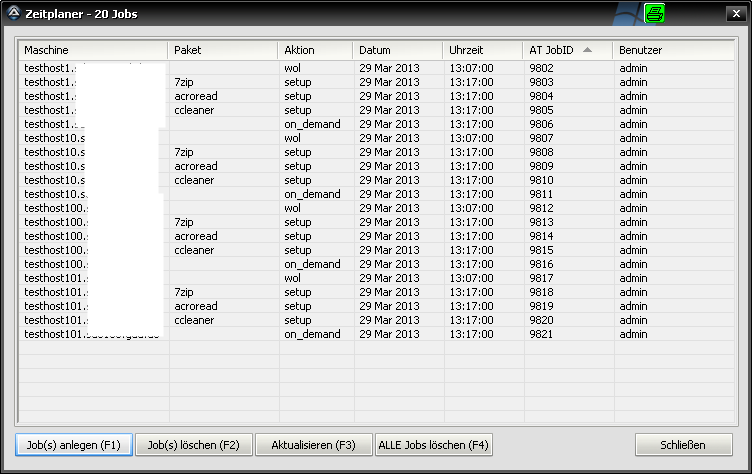
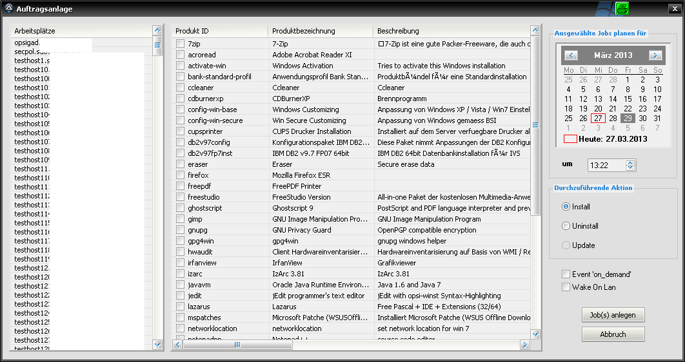
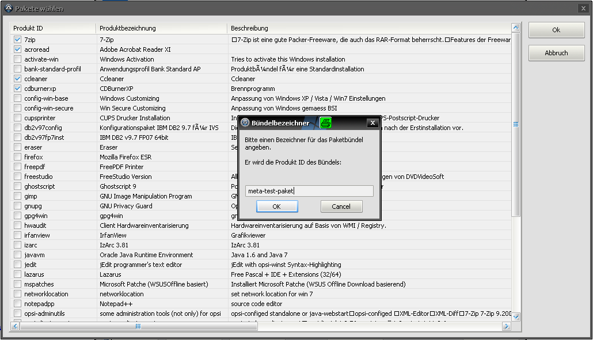

.. index:: ! Zeitplaner

Zeitplaner
==========

|image39|

Der Zeitplaner ermöglicht die Anlage und Verwaltung von zeitgesteuerten (De-)Installationsaufträgen von localboot Paketen direkt am opsi Server. Bitte die :ref:`technischen Voraussetzungen <hints>` dafür unbedingt lesen!

*Hinweis:*
Da sowohl beim Öffnen des Zeitplaners, als auch nach dem Schließen des Auftragsanlagedialogs die bestehenden Aufträge direkt vom Server abgerufen werden müssen, kann es einen Moment dauern. Bitte hier um etwas Geduld, vor allem bei vielen vorhandenen Aufträgen.

+-------------------------+-------------------------+-------------------------+
| Funktion                | Hotkey                  | Beschreibung            |
+-------------------------+-------------------------+-------------------------+
| |image40|               | F1                      | Neue                    |
|                         |                         | (De-)Installationsauftr |
|                         |                         | äge                     |
|                         |                         | anlegen                 |
+-------------------------+-------------------------+-------------------------+
| |image41|               | F2                      | Einzelne, ausgewählte   |
|                         |                         | Aufträge löschen, es    |
|                         |                         | erfolgt eine            |
|                         |                         | Sicherheitsabfrage      |
+-------------------------+-------------------------+-------------------------+
| |image42|               | F3                      | Aktualisieren der       |
|                         |                         | Anzeige                 |
+-------------------------+-------------------------+-------------------------+
| |image43|               | F4                      | Sämtliche aktiven       |
|                         |                         | Aufträge entfernen, es  |
|                         |                         | erfolgt eine            |
|                         |                         | Sicherheitsabfrage      |
+-------------------------+-------------------------+-------------------------+
| |image44|               |                         | Schließen der Anzeige   |
+-------------------------+-------------------------+-------------------------+

**Erläuterungen zur Spalte "Aktion"**

Hier werden die unterschiedlichen Auftragstypen angezeigt::

    - setup:      Installanstionsanforderung
    - uninstall:  Deinstallationsanforderung
    - wol:        Vor dem eigentlichen Auftrag wird ein Wake On Lan Paket an die betreffende Maschine gesendet.
    - on\_demand: Nachdem die Aufträge eingestellt worden sind, wird ein "on\_demand" Ereignis ausgelöst.

.. index:: ! Zeitplaner; Aufträge anlegen

Aufträge anlegen
----------------

|image45|

In diesem Dialog wird ein neuer (Massen-)Auftrag definiert. Bitte auf jeden Fall auch die :ref:`technischen Hinweise <hints>` beachten!

+--------------------------------------+--------------------------------------+
| Feld / Funktion                      | Hinweis                              |
+--------------------------------------+--------------------------------------+
| Liste "Arbeitsplätze"                | Alle am opsi Server definierten      |
|                                      | Clients                              |
|                                      |                                      |
|                                      | Mit Hilfe der <Ctrl>-Taste können    |
|                                      | mehrere Arbeitsplätze auf einmal     |
|                                      | ausgewählt werden. Die Aufträge      |
|                                      | werden dann für alle ausgewählten    |
|                                      | Arbeitsplätzen gleichermaßen         |
|                                      | angelegt.                            |
+--------------------------------------+--------------------------------------+
| Liste "Produkte"                     | Sämtliche aktive localboot Pakete    |
|                                      |                                      |
|                                      | Die Auswahl erfolgt über die         |
|                                      | Kontrollkästchen vor der Produkt ID. |
+--------------------------------------+--------------------------------------+
| Kalenderansicht                      | Geplantes Datum der Aufträge, der    |
|                                      | aktuelle Tag ist dabei hervorgehoben |
+--------------------------------------+--------------------------------------+
| Uhrzeitfeld                          | Startzeit der Aufträge               |
+--------------------------------------+--------------------------------------+
| Durchzuführende Aktion               | Install = Setzt den                  |
|                                      | Anforderungsstatus des Pakets an der |
|                                      | Maschine auf "setup"                 |
|                                      |                                      |
|                                      | Uninstall = Setzt den                |
|                                      | Anforderungsstatus des Pakets an der |
|                                      | Maschine auf "uninstall"             |
|                                      |                                      |
|                                      | Custom = Setzt den                   |
|                                      | Anforderungsstatus des Pakets an der |
|                                      | Maschine auf "custom"                |
|                                      |                                      |
+--------------------------------------+--------------------------------------+
| Event 'on\_demand'                   | Haken setzen, um einen on\_demand    |
|                                      | Auftrag pro Maschine zusätzlich      |
|                                      | erstellen zu lassen                  |
+--------------------------------------+--------------------------------------+
| Wake On Lan                          | Haken setzen, um einen WakeOnLan     |
|                                      | Auftrag pro Maschine zusätzlich      |
|                                      | erstellen zu lassen                  |
|                                      |                                      |
|                                      | Der WakeOnLan Auftrag wird mit dem   |
|                                      | in den :ref:`Einstellungen           |
|                                      | <settings_opsi>`                     |
|                                      | hinterlegten Vorlauf erstellt.       |
|                                      | Standardvorlauf ist 15 Minuten.      |
+--------------------------------------+--------------------------------------+
| |image46|                            | Joberzeugung anstoßen                |
+--------------------------------------+--------------------------------------+
| |image47|                            | Abbrechen, es werden keine Jobs      |
|                                      | erstellt.                            |
+--------------------------------------+--------------------------------------+

.. index:: ! Zeitplaner; Technisches Hinweise

.. _hints:

Technische Hinweise
-------------------

**Verwendung des Zeitplaners:**

Die von opsi PackageBuilder verwalteten Softwarepflegeaufträge werden im Hintergrund direkt am opsi Server als sogenannte AT Aufträge eingestellt. Dazu ist die Installation des ATD Dämon und der zugehörigen Kommandozeilentools erforderlich. Wie dieser Dämon zu installieren ist, kann der technischen Beschreibung der verwendeten Linux Distribution, auf der der opsi Server installiert ist, entnommen werden.

AT Aufträge bestehen technisch gesehen aus einzelnen Linux Skripten, die in einer bestimmten Reihenfolge und zu einem vordefinierten Zeitpunkt ausgeführt werden. Diese befinden sich im sogenannten Spool-Verzeichnis des ATD Dämon und können durch den Anwender oder Administrator direkt an der Serverkonsole über die Kommandozeilentools at, atq, atrm, etc. verwaltet werden. opsi PackageBuilder verwendet die gleichen Tools zur Pflege der AT Aufträge.

Wenn viele AT Aufträge angelegt werden, spielt es bei der Verwaltung mittels opsi PackageBuilder eine große Rolle, wie viele Dateien auf dem Linuxserver durch einen Benutzer gleichzeitig geöffnet werden dürfen, da der opsi PackageBuilder beim Anlegen und Auslesen der Aufträge jeden einzelnen Auftrag analysieren muss. Da in großen Netzwerken aufgrund der hohen Rechneranzahl durchaus viele Aufträge vorhanden sein können, ist es gar nicht selten, dass auch mehrere tausend Aufträge erzeugt werden.

Linux ist als Betriebssystem in hohem Maß konfigurierbar, um vielen Einsatzmöglichkeiten und Aspekten gerecht zu werden. Aus Sicherheitsgründen läßt sich daher die Anzahl der gleichzeitig zu öffnenden Dateien limitieren. Dieses Limit wird auch ``ulimit`` genannt. Wenn dieses Limit zu gering eingestellt ist, kann es bei der Verwaltung der AT Aufträge zu Fehlern kommen. Daher sollte das eingestellte Limit VOR der Anlage einer größeren Anzahl von Aufträgen auf jeden Fall kontrolliert und ggf. angepasst werden.

Um das ``ulimit`` zu überprüfen, meldet man sich am opsi Server direkt als root Benutzer an und setzt folgendes Kommando ab:

.. code-block:: bash

    ulimit -n

Die damit ermittelte Zahl entspricht der Anzahl der gleichzeitig geöffneten Dateien. In vielen Fällen wird dieser Wert auf 1024 eingestellt sein, sofern man nicht bereits vorher Anpassungen vorgenommen hat. Um diesen Wert dauerhaft zu erhöhen, muss ein evtl. bereits vorhandener Eintrag in der Datei ``/etc/security/limits.conf`` angepasst oder eine neue Zeile hinzugefügt werden. Um bspw. diesen Wert auf 5000 zu erhöhen, wird folgender Eintrag benötigt:

.. code-block:: bash

    \* soft nofile 5000

Dabei haben die 4 Werte folgende Bedeutung::

    - \*        : der Eintrag gilt für jeden Benutzer -> damit ließe sich die Anzahl der offenen Dateien auch nur speziell für den opsi-admin Benutzer anpassen
    - soft      : der Wert kann nachträglich durch den Benutzer wieder geändert werden
    - nofile    : der Eintrag regelt die Anzahl der offenen Dateien
    - 5000      : Wert der eingestellt werden soll

Mit der beispielhaft angegeben Zeile wird also für jeden User die Anzahl der gleichzeitig offenen Dateien nachträglich änderbar auf 5000 gesetzt.

**Zusätzlicher Hinweis zu CentOS (aufgetreten bei Version 6.4), könnte aber auch bei anderen Linux-Distributionen wichtig sein:**

Sollte der ATD zwischen der Abarbeitung der Jobs immer eine Pause einlegen (1 od. mehrere Minuten), dann kann das folgendermaßen korrigiert werden:

    In der Datei /etc/sysconfig/atd dafür sorgen, dass die OPTS-Variable mit den Parametern -b 0 ergänzt wird. Falls die Variable noch gar nicht vorhanden ist, den folgenden Eintrag ans Ende der Datei anhängen:

    .. code-block:: bash

        OPTS="-b 0"

    Der Parameter -b 0 deaktiviert die Pause zwischen der Ausführung der einzelnen AT-Jobs.

    Ist der Wert eingetragen und gespeichert, muss der ATD neu gestartet werden. Unter CentOS 6.4 kann das durch einen service atd restart Befehl an der Konsole als root User erfolgen.

    (Diese Beschreibung gilt nur für CentOS, dass die Startparameter für den ATD aus der genannten Datei zieht. Es ist im Einzelfall pro Distribution zu prüfen, wo der genannte Parameter eingefügt werden muss, damit der ATD die Anpassung beim Neustart mitbekommt.)

**Verwendung des Auftragsanlagedialogs:**

Beim ersten Öffnen werden sämtliche Maschinen und aktiven Localboot Produkte vom opsi Server ermittelt. Das kann bei einer hohen Anzahl Clients und Produkten einige Zeit in Anspruch nehmen! Bitte hier Geduld bewahren. Der Auslesevorgang findet i. d. R. nur einmalig statt, außer es wurde in den Einstellungen der Haken bei "Beim Öffnen des Zeitplaners Maschinen und Produkte immer einlesen" gesetzt. Dann werden die Daten bei jedem Öffnen des Zeitplaners ermittelt.

Wenn viele Aufträge auf einmal am Server eingestellt werden sollen, bitte Geduld bewahren! Das kann eine je nach Menge eine Weile in Anspruch nehmen.

Beispielrechnung - 100 Clients á 5 Produkte, inkl. on\_demand und wol bedeutet 700 (!) Einzelaufträge:

    100 * 5: Anzahl Produktinstallationen
    + 100 WoL Aufträge
    + 100 on\_demand Aufträge

In solchen Fällen kann es sinnvoll sein, statt der Einzelaufträge ein Paketbündel anzulegen und die (wie in diesem Beispiel 5) Produkte zusammenzufassen. Das senkt die Anzahl der Aufträge am effektivsten. Für die :ref:`Schnellanlage von Paketbündeln <bundle>` steht in opsi PackageBuilder eine eigene Funktion zur verfügung.

