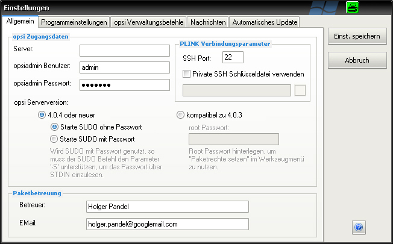
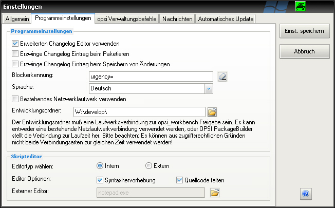
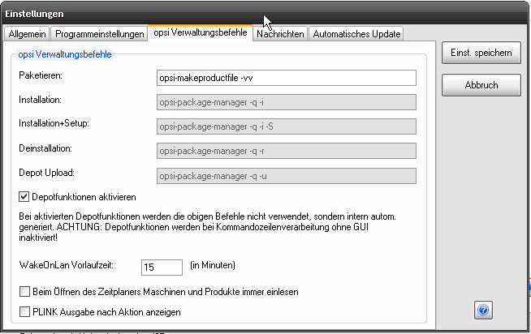
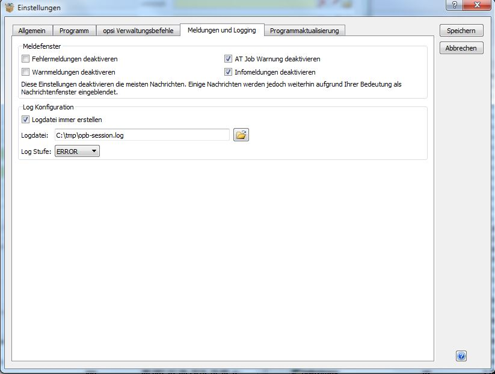
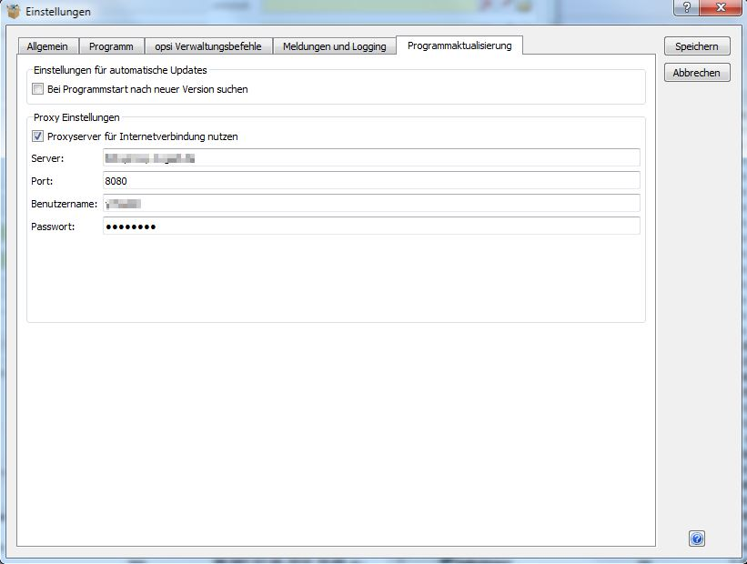

.. index:: ! Einstellungen

Einstellungen
=============

Die einzelnen Bestandteile des Einstellungen Dialogs in der Übersicht.

Hinweis: es kann mehr als eine Konfiguration parallel betrieben werden. Genaueres zum Vorgehen dazu unter \ `Mehrere Konfigurationen. <#MehrereKonfigurationen>`__

.. index:: ! Einstellungen; Allgemein

Allgemein
---------

|image78|

.. index:: ! Einstellungen; Programm

Programmeinstellungen
---------------------

|image79|

.. index:: ! Einstellungen; opsi Verwaltungsbefehle

opsi Verwaltungsbefehle
-----------------------

|image80|

.. index:: ! Einstellungen; Nachrichten

Nachrichten
-----------

|image81|

.. index:: ! Einstellungen; Automatische Updates

Automatische Updates
--------------------

|image82|

