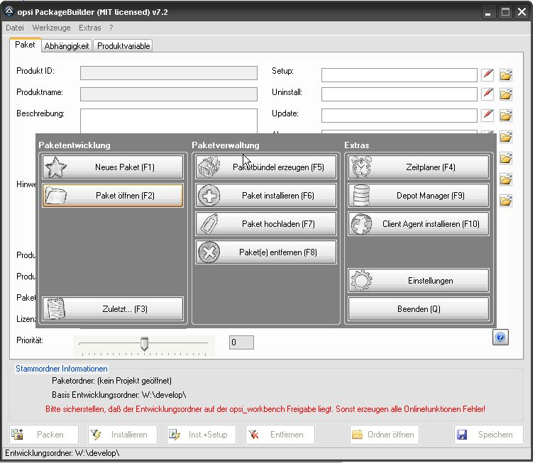

Start
=====

|image2|

Beim Programmstart können die meist verwendeten Funktionen aufgerufen
werden. Für einen schnellen Arbeitsablauf lassen sich die einzelnen
Funktionen per Funktionstasten aufrufen.

+-------------------------+-------------------------+-------------------------+
| Funktion                | Hotkey                  | Beschreibung            |
+-------------------------+-------------------------+-------------------------+
| Neues Paket             | F1                      | Ein neues Software      |
|                         |                         | Installationspaket im   |
|                         |                         | Entwicklungsordner      |
|                         |                         | anlegen                 |
+-------------------------+-------------------------+-------------------------+
| Paket öffnen            | F2                      | Aus dem                 |
|                         |                         | Entwicklungsordner eine |
|                         |                         | bestehende              |
|                         |                         | Paketstruktur einlesen. |
|                         |                         | Es können keine         |
|                         |                         | gepackten Pakete        |
|                         |                         | (\*.opsi) geöffnet      |
|                         |                         | werden.                 |
+-------------------------+-------------------------+-------------------------+
| Zuletzt...              | F3                      | Die letzten fünf        |
|                         |                         | bearbeiteten            |
|                         |                         | Paketstrukturen         |
+-------------------------+-------------------------+-------------------------+
| Paketbündel erzeugen    | F5                      | Hilfsfunktion zur       |
|                         |                         | Schnellanlage von       |
|                         |                         | Paketbündeln. Diese     |
|                         |                         | Funktion erzeugt ein    |
|                         |                         | Paket, welches nur      |
|                         |                         | Abhängigkeiten zu       |
|                         |                         | weiteren Pakete         |
|                         |                         | beinhaltet, um immer    |
|                         |                         | wiederkehrende          |
|                         |                         | Installationen der      |
|                         |                         | gleichen Produkte zu    |
|                         |                         | vereinfachen.           |
+-------------------------+-------------------------+-------------------------+
| Paket installieren      | F6                      | Bereits bestehende      |
|                         |                         | Paketdateien (\*.opsi)  |
|                         |                         | können hierüber direkt  |
|                         |                         | auf dem Server          |
|                         |                         | installiert werden.     |
+-------------------------+-------------------------+-------------------------+
| Paket hochladen         | F7                      | Paket ohne Installation |
|                         |                         | in einen Repository     |
|                         |                         | Ordner hochladen        |
+-------------------------+-------------------------+-------------------------+
| Paket(e) entfernen      | F8                      | Bereits auf dem Server  |
|                         |                         | bestehende Pakete       |
|                         |                         | können hierüber direkt  |
|                         |                         | deinstalliert werden.   |
+-------------------------+-------------------------+-------------------------+
| Zeitplaner              | F4                      | Öffnen des Zeitplaners  |
|                         |                         | zum Einstellen von AT   |
|                         |                         | Aufträgen am opsi       |
|                         |                         | Server                  |
+-------------------------+-------------------------+-------------------------+
| Depot Manager           | F9                      | Depotverwaltung, bei    |
|                         |                         | ersten Öffnen werden    |
|                         |                         | alle Depotserver        |
|                         |                         | ausgelesen und für      |
|                         |                         | einen schnelleren       |
|                         |                         | Zugriff später gecacht. |
+-------------------------+-------------------------+-------------------------+
| Client Agent            | F10                     | Verteilung des          |
| installieren            |                         | opsi-client-agent via   |
|                         |                         | /var/lib/opsi/depot/ops |
|                         |                         | i-client-agent/opsi-dep |
|                         |                         | loy-client-agent        |
+-------------------------+-------------------------+-------------------------+
| Zeige Log               |                         | Öffnet den LogViewer    |
+-------------------------+-------------------------+-------------------------+
| Einstellungen           |                         | Öffnet den              |
|                         |                         | Einstellungendialog     |
+-------------------------+-------------------------+-------------------------+
| Beenden                 | Q / Esc                 | Beendet die Anwendung   |
+-------------------------+-------------------------+-------------------------+

