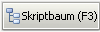

Reiter "Paket"
==============

|image3|

Dieser Reiter beinhaltet die wesentlichen Paketinformationen, wie sie
auch durch das opsi Tool "opsi-newprod" zur Paketanlage abgefragt
werden.

Die Bezeichnungen sind weitestgehend selbsterklärend, daher nur einige
Hinweise:

+--------------------------------------+---------------------------------------+
| Feld / Funktion                      | Hinweis                               |
+--------------------------------------+---------------------------------------+
| Priorität                            | Mit dem Schieber läßt sich die        |
|                                      | Priorität von -100 bis +100           |
|                                      | einstellen. Zum Zurücksetzen auf 0    |
|                                      | einmal auf das Anzeigefeld daneben    |
|                                      | klicken.                              |
+--------------------------------------+---------------------------------------+
| Skripteingabefelder                  | Diese Felder entsprechen den          |
|                                      | unterschiedlichen opsi-winst          |
|                                      | Installationsskripten. Nähere         |
|                                      | Informationen dazu finden sich in     |
|                                      | den opsi Anwendungshandbüchern.       |
+--------------------------------------+---------------------------------------+
| |image4|                             | Öffnet das nebenstehende Skript im    |
|                                      | in den `Einstellungen                 |
|                                      | <#Programmeinstellungen>`__           |
|                                      | hinterlegten Editor. Standard ist     |
|                                      | notepad.exe.                          |
+--------------------------------------+---------------------------------------+
| |image5|                             | Zeigt einen Dateiauswahldialog        |
|                                      | relativ zum Paketordner an und        |
|                                      | stellt sicher, dass nur Skripte       |
|                                      | innerhalb des Paketes ausgewählt      |
|                                      | werden können.                        |
+--------------------------------------+---------------------------------------+
| |image6|                             | Öffnet den in den `Einstellungen      |
|                                      | <#Programmeinstellungen>`__           |
|                                      | gewählten Changelog Editor Typ.       |
|                                      | Näheres dazu unter "`Changelog        |
|                                      | Editor <ChangelogEditor>`__"          |
+--------------------------------------+---------------------------------------+
| |image7|                             | Öffnet die `Strukturanzeige           |
|                                      | <#Skriptbaum>`__                      |
|                                      | der Installationsskripte. Von dort    |
|                                      | können auch sämtliche per "sub" bzw.  |
|                                      | "include" eingebundenen Skripte       |
|                                      | eingesehen und, sofern im             |
|                                      | Paketordner befindlich, bearbeitet    |
|                                      | werden. Außerhalb des Paketordners    |
|                                      | abgelegte Skripte können aus          |
|                                      | Sicherheitsgründen nicht bearbeitet   |
|                                      | werden.                               |
+--------------------------------------+---------------------------------------+

.. |image3| image:: ../img/ReiterPaket.jpg
.. |image4| image:: ../img/SkriptEdit.png

