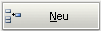
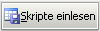

.. index:: ! Reiter "Produktvariablen"

Reiter "Produktvariablen"
=========================

|image12|

Auf diesem Reiter können Produktvariablen (product properties) definiert
und bearbeitet werden.

Der obere Teil des Fensters beinhaltet eine tabellarische Aufstellung
der derzeit im Paket definierten Produktvariablen. Sollte in der Liste
nur ein einziger Eintrag in der Spalte "Bezeichner" mit dem Inhalt
"empty" angezeigt werden, so weißt das daraufhin, dass noch keinerlei
Produktvariablen definiert worden sind.

+-------------------------+-------------------------+-------------------------+
| Feld / Funktion         | Beschreibung            | Hinweise                |
+-------------------------+-------------------------+-------------------------+
| Bezeichner              | Name der                | Dieser Bezeichner wird  |
|                         | Produktvariable         | in der                  |
|                         |                         | Produktkonfiguration im |
|                         |                         | opsi-configed angezeigt |
|                         |                         | und ist innerhalb der   |
|                         |                         | Skripte mit der         |
|                         |                         | Funktion                |
|                         |                         | "GetProductProperty"    |
|                         |                         | auslesbar.              |
|                         |                         |                         |
|                         |                         | Weitere Informationen   |
|                         |                         | siehe OPSI Getting      |
|                         |                         | Started Handbuch.       |
+-------------------------+-------------------------+-------------------------+
| Typ                     | Variablentyp            | Mögliche Werte: unicode |
|                         |                         | / bool                  |
|                         |                         |                         |
+-------------------------+-------------------------+-------------------------+
| Mehrfachwert            | Bestimmt, ob die        | *Nur bei Typ "unicode"  |
|                         | Produktvariable nur     | verfügbar*              |
|                         | genau einen oder        |                         |
|                         | mehrere Werte annehmen  |                         |
|                         | kann                    |                         |
+-------------------------+-------------------------+-------------------------+
| Änderbar                | Bestimmt, ob die        | *Nur bei Typ "unicode"  |
|                         | Vorgabewerte mit neuen  | verfügbar*              |
|                         | oder zusätzlichen       |                         |
|                         | Werten überschrieben    |                         |
|                         | werden können oder      |                         |
|                         | nicht                   |                         |
+-------------------------+-------------------------+-------------------------+
| Beschreibung            | Beschreibung der        | Wird im opsi-configed   |
|                         | Variablenfunktion       | als Tooltip angezeigt   |
+-------------------------+-------------------------+-------------------------+
| Werte                   | Komma-separiert Liste   | Falls "Änderbar" auf    |
|                         | der möglichen           | "True" gesetzt wurde,   |
|                         | Eingabewerte            | kann die Liste später   |
|                         |                         | innerhalb von           |
|                         |                         | opsi-configed ergänzt   |
|                         |                         | werden.                 |
|                         |                         |                         |
|                         |                         | *Nur bei Typ "unicode"  |
|                         |                         | verfügbar*              |
|                         |                         |                         |
+-------------------------+-------------------------+-------------------------+
| Vorgabe (Freitextfeld / | Vorgabewert             | *Nur bei Typ "unicode"  |
| Auswahlliste)           |                         | verfügbar: Freitextfeld*|
|                         |                         |                         |
|                         |                         | *Nur bei Typ "bool"     |
|                         |                         | verfügbar: Auswahlliste*|
+-------------------------+-------------------------+-------------------------+
| |image13|               | Eine neue               |                         |
|                         | Produktvariable         |                         |
|                         | anlegen.                |                         |
|                         |                         |                         |
|                         | Es öffnet sich ein      |                         |
|                         | Dialogfenster, in dem   |                         |
|                         | die neuen Werte erfasst |                         |
|                         | werden können. Die      |                         |
|                         | Feldbezeichnungen und   |                         |
|                         | -vorgaben lauten        |                         |
|                         | entsprechend.           |                         |
+-------------------------+-------------------------+-------------------------+
| |image14|               | Eine bestehende         | *Wenn der Reiter        |
|                         | Produktvariable ändern  | gewechselt wird, ohne   |
|                         | und aktualisieren.      | die Änderung zu         |
|                         |                         | übernehmen, gehen diese |
|                         | Um eine bestehende      | i d. R. verloren.*      |
|                         | Produktvariable zu      |                         |
|                         | verändern, wie folgt    |                         |
|                         | vorgehen:               |                         |
|                         |                         |                         |
|                         | #. in der               |                         |
|                         |    tabellarischen       |                         |
|                         |    Auflistung die       |                         |
|                         |    entsprechende Zeile  |                         |
|                         |    anklicken            |                         |
|                         | #. die Werte in den     |                         |
|                         |    einzelnen Feldern    |                         |
|                         |    entsprechend         |                         |
|                         |    anpassen             |                         |
|                         | #. auf "Übernehmen"     |                         |
|                         |    klicken              |                         |
|                         |                         |                         |
|                         | Die Änderung wird       |                         |
|                         | sofort in die           |                         |
|                         | tabellarische           |                         |
|                         | Auflistung übernommen.  |                         |
+-------------------------+-------------------------+-------------------------+
| |image15|               | Diese Funktion          | Werden Produktvariablen |
|                         | ermöglicht das          | gefunden, so wird für   |
|                         | automatische Ermitteln  | jede neue Variable ein  |
|                         | und Einlesen von        | kompletter Datensatz    |
|                         | Produktvariablen, die   | abgefragt.              |
|                         | in den verschiedenen    |                         |
|                         | Installationsskripten   | *Die bereits vorhandenen|
|                         | definiert sind.         | und definierten         |
|                         |                         | Produktvariablen werden |
|                         | Das erleichtert         | berücksichtigt und nur  |
|                         | allerdings die Suche    | neue aufgenommen.*      |
|                         | und Eintragung neuer    |                         |
|                         | Produktvariablen, die   |                         |
|                         | im Rahmen der           |                         |
|                         | Skriptentwicklung hinzu |                         |
|                         | gekommen sind.          |                         |
|                         |                         |                         |
+-------------------------+-------------------------+-------------------------+
| |image16|               | Eine bestehende         | *Solange das Paket nicht|
|                         | Produktvariable         | gespeichert wurde, kann |
|                         | entfernen.              | eine ungewollte         |
|                         |                         | Löschung durch erneutes |
|                         | Um eine bestehende      | Einladen rückgängig     |
|                         | Produktvariable zu      | gemacht werden. Nach    |
|                         | entfernen, wie folgt    | dem Speichern muss die  |
|                         | vorgehen:               | Vorgängerversion der    |
|                         |                         | control Datei manuell   |
|                         | #. in der               | aus dem                 |
|                         |    tabellarischen       | Unterverzeichnis "OPSI" |
|                         |    Auflistung die       | des Pakets              |
|                         |    entsprechende Zeile  | zurückgesichert werden.*|
|                         |    anklicken            |                         |
|                         | #. auf "Löschen"        |                         |
|                         |    klicken              |                         |
|                         | #. den nachfolgenden    |                         |
|                         |    Warnhinweis          |                         |
|                         |    bestätigen           |                         |
|                         |                         |                         |
|                         | Die Änderung wird       |                         |
|                         | sofort in die           |                         |
|                         | tabellarische           |                         |
|                         | Auflistung übernommen.  |                         |
+-------------------------+-------------------------+-------------------------+

.. |image12| image:: ../img/ReiterProduktvariable.jpg

.. |image16| image:: ../img/btnDel.png
